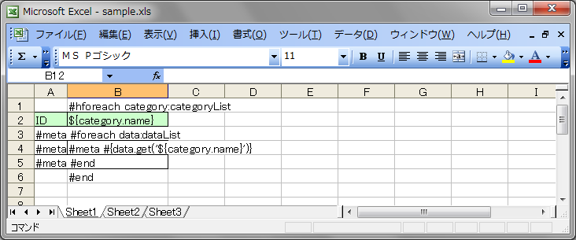
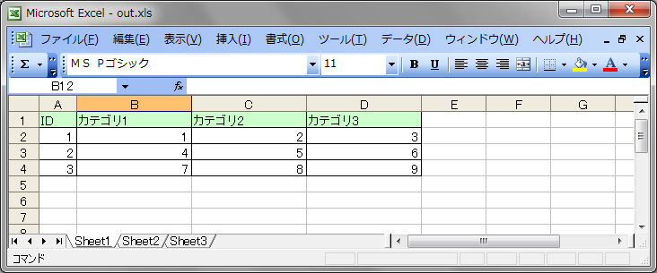

fisshplate-meta
===============

Makes meta templating for Fisshplate Excel template engine.

Fisshplateでは縦方向、横方向の繰り返しはできるのですが、縦横両方向に伸びるようなテンプレートを記述することができません。
そこで、Fisshplateによる処理を二回実行し、まずは横方向の繰り返し処理を実行して横方向を確定し、
縦方向の繰り返し処理用のタグの入ったExcelファイルを生成し、二回目の処理で縦方向の繰り返し処理を行うという方法を使っていました。
かっこよく言うとメタテンプレートというやつです。

これをExcelの記述だけで実現できるようにしてみました。用意するのは以下のようなテンプレートです。



このテンプレートを次のようなコードで処理します。

```java
// 横方向に繰り返すリストを準備
List<Category> categoryList = new ArrayList<Category>();
categoryList.add(new Category("カテゴリ1"));
categoryList.add(new Category("カテゴリ2"));
categoryList.add(new Category("カテゴリ3"));

// 縦方向に繰り返すリストを準備
List<Map<String, Integer>> dataList = new ArrayList<Map<String,Integer>>();

Map<String, Integer> row1 = new HashMap<String, Integer>();
row1.put("カテゴリ1", 1);
row1.put("カテゴリ2", 2);
row1.put("カテゴリ3", 3);
dataList.add(row1);

Map<String, Integer> row2 = new HashMap<String, Integer>();
row2.put("カテゴリ1", 4);
row2.put("カテゴリ2", 5);
row2.put("カテゴリ3", 6);
dataList.add(row2);

Map<String, Integer> row3 = new HashMap<String, Integer>();
row3.put("カテゴリ1", 7);
row3.put("カテゴリ2", 8);
row3.put("カテゴリ3", 9);
dataList.add(row3);

Map<String, Object> data = new HashMap<String, Object>();
data.put("categoryList", categoryList);
data.put("dataList", dataList);

// テンプレートを処理
InputStream is = SampleTest.class.getResourceAsStream("/sample.xls");
OutputStream os = new FileOutputStream("out.xls");

FisshplateUtil.process(is, data, os);

is.close();
os.close();
```

するとこんな感じで縦横両方向に可変の表が出力されます。



FisshplateUtil.process()は必要に応じて内部で二回Fisshplateのテンプレートの展開処理を行っています。

```
#meta 任意の文字列
```

というように#metaタグを書いておくと、#metaタグに続けて記述した任意の文字列が二回目に処理されます。また、

```
#meta #{変数}
```

のように#metaタグに続けて #{...} と記述した場合は ${...} に変換して実行されます。
一度目の処理では変数展開されたくないけど、二回目の処理で展開したい場合に使用します。